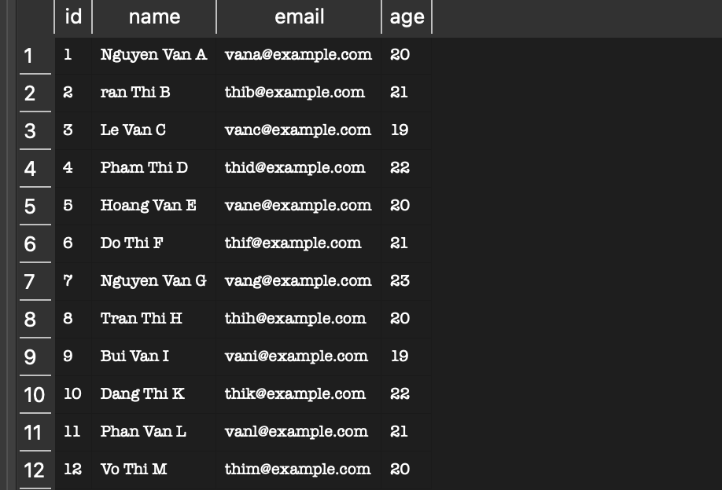
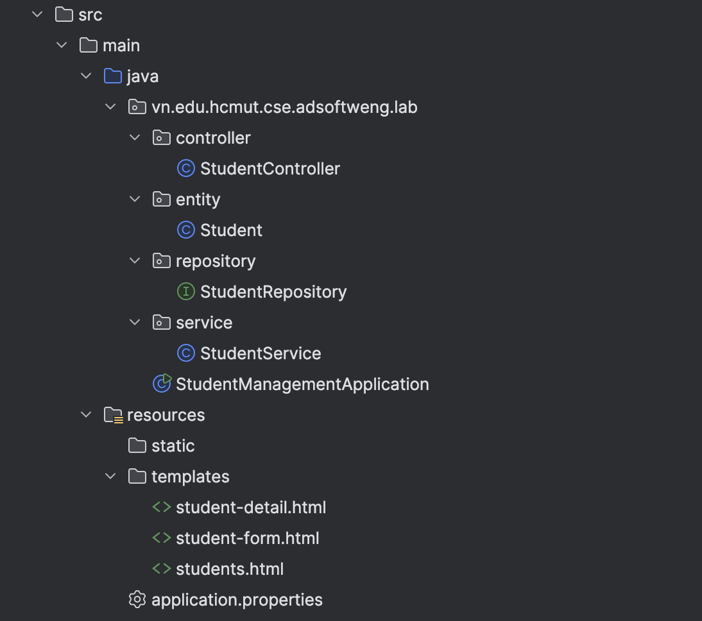
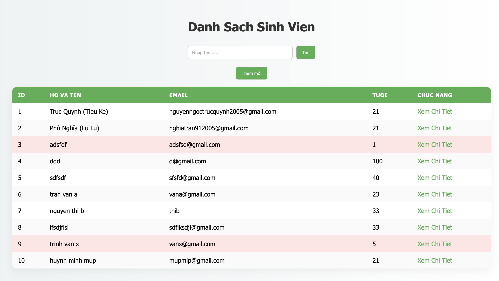
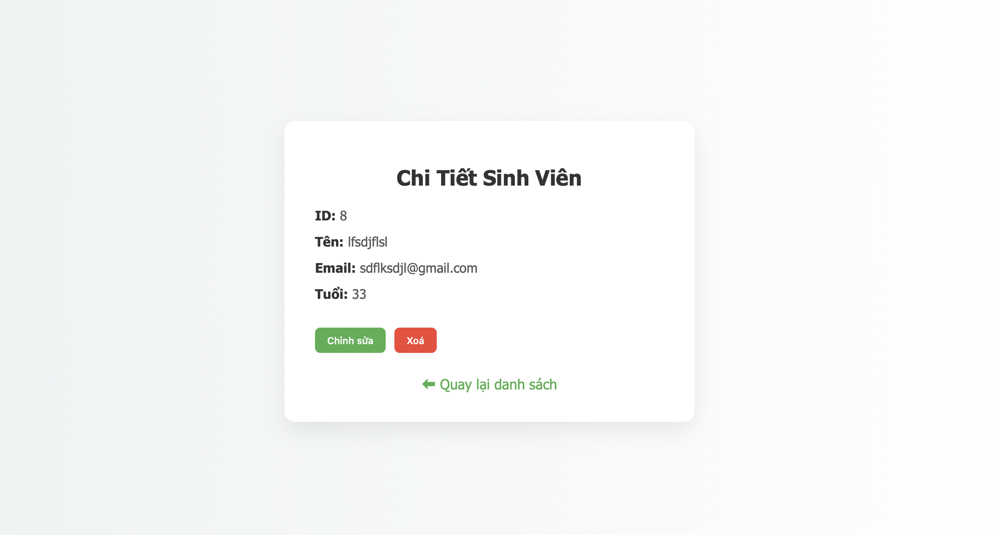
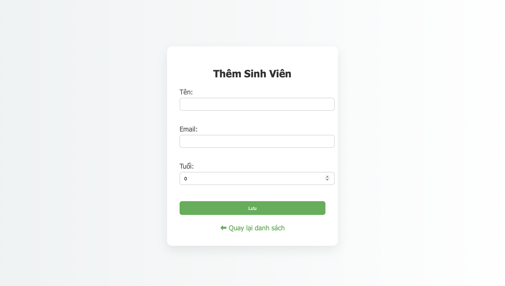
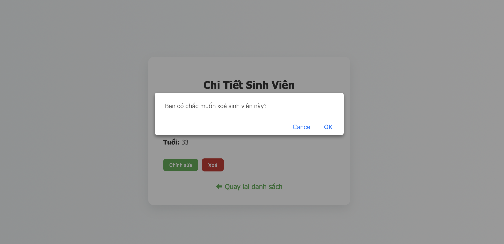

# Danh sách nhóm
- Trần Nguyễn Phú Nghĩa - 2312284 
---
# Public URL của webservice
```
https://student-management-yv94.onrender.com/students
```
---
# Hướng dẫn cách chạy

##  Yêu cầu môi trường

Trước khi chạy, cần cài đặt:

- Java 21
- Maven 3.9+
- (Tuỳ chọn) Docker nếu muốn build bằng container

## Clone source code
```
git clone <repository-url>
cd student-management
```

## CẤU HÌNH POSTGRESQL BẰNG BIẾN MÔI TRƯỜNG (ENV)
Thêm các biến môi trường để kết nối với database 
```
POSTGRES_HOST=...
POSTGRES_PORT=...
POSTGRES_DB=...
POSTGRES_USER=...
POSTGRES_PASSWORD=...
```
## Cách ứng dung dùng Docker

1) Build image
```
docker build -t student-management .
```

2) Run container với .env
Chạy container với các biến môi trường trong file .env 
```
docker run -p 8080:8080 --env-file .env student-management
```
## Truy cập

Truy cập ứng dụng tại:
```
http://localhost:8080/students
```
---
# Câu trả lời cho các phần lab

## **Lab 1**

#### - Dữ liệu lớn:


#### - Ràng buộc khoá chính (Primary Key):
Trong bảng `students`, cột `id` được khai báo:

```sql
id INTEGER PRIMARY KEY
```
Mỗi giá trị của khoá chính phải:

- **Không được trùng lặp (UNIQUE)**
- **Không được NULL**
- Mỗi bảng chỉ có **một Primary Key**


Khi thêm một sinh viên có `id = 1` trong khi bảng đã tồn tại `id = 1`, hệ thống sẽ báo lỗi:
```
UNIQUE constraint failed: students.id
```
Database chặn thao tác này để đảm bảo:

+ Tính toàn vẹn dữ liệu (Data Integrity)
Mỗi sinh viên phải có một mã số duy nhất. Nếu cho phép trùng, hệ thống sẽ không thể phân biệt được hai sinh viên.

+ Tránh mâu thuẫn dữ liệu
Nếu tồn tại hai bản ghi cùng `id`, các thao tác như:UPDATE, DELETE, JOIN với bảng khác

sẽ gây ra sai lệch hoặc không xác định chính xác bản ghi cần xử lý.

+ Đảm bảo tính nhất quán (Consistency)
Hệ quản trị cơ sở dữ liệu (DBMS) luôn đảm bảo dữ liệu sau mỗi thao tác phải ở trạng thái hợp 


#### - Toàn vẹn dữ liệu (Constraints)
Giả sử thực hiện câu lệnh:

```sql
INSERT INTO students (id, name, email, age)
VALUES (20, NULL, 'test@example.com', 22);
```
--> Database **Không báo lỗi** vì cột name khi tạo bảng không có ràng buộc *NOT NULL*

Việc không khai báo `NOT NULL` cho những trường quan trọng có thể gây ra nhiều vấn đề khi lập trình Java đọc dữ liệu lên.


- Ảnh hưởng khi đọc dữ liệu bằng Java
```
NullPointerException
```
- Ảnh hưởng ở tầng nghiệp vụ (Business Logic)
```
- Không thể hiển thị tên sinh viên
- Gây lỗi khi validate dữ liệu
- Ảnh hưởng logic tìm kiếm, sắp xếp
- Có thể gây lỗi khi serialize sang JSON
```

- Ảnh hưởng đến chất lượng dữ liệu
```
- Dữ liệu không đầy đủ
- Mất tính chuyên nghiệp của hệ thống
- Khó kiểm soát lỗi về sau
```

#### - Cấu hình hibernate:
Nguyên nhân mỗi lần tắt ứng dụng và chạy lại thì dữ liệu trong DB bị mất
```
spring.jpa.hibernate.ddl-auto=create
 ```
Khi ứng dụng chạy:

- Hibernate **xoá toàn bộ bảng cũ**
- Sau đó **tạo lại bảng mới từ đầu**
- Dữ liệu cũ sẽ bị mất hoàn toàn

→ Hibernate lại tạo schema mới  
→ Database bị reset  
→ Dữ liệu trước đó biến mất

---
# Các module 


Ứng dụng được chia thành các lớp (layers) riêng biệt để dễ dàng quản lý và bảo trì:


- StudentManagementApplication: File thực thi chính (Main class) dùng để khởi chạy toàn bộ ứng dụng Spring Boot.
- application.properties: File cấu hình hệ thống (kết nối database, cổng server, v.v.).

### Package controller

Lớp điều hướng và xử lý các yêu cầu từ người dùng.

- StudentController: Tiếp nhận các HTTP Request (như GET, POST), gọi đến tầng Service để xử lý dữ liệu và trả về các trang HTML tương ứng hoặc dữ liệu cho phía Client.

### Package service

Lớp xử lý nghiệp vụ (Business Logic).

- StudentService: Nơi thực hiện các tính toán, kiểm tra logic nghiệp vụ trước khi lưu vào database hoặc trả về cho Controller. Nó đóng vai trò trung gian giữa Repository và Controller.

### Package repository

Lớp giao tiếp với cơ sở dữ liệu (Data Access Layer).

- StudentRepository: Thường là một Interface kế thừa từ JpaRepository. Nó cung cấp các phương thức có sẵn để thực hiện các thao tác CRUD (Thêm, Đọc, Sửa, Xóa) xuống database SQLite.

### Package entity

Lớp định nghĩa cấu trúc dữ liệu.

- Student: Đại diện cho bảng (Table) trong cơ sở dữ liệu. Mỗi đối tượng Student sẽ tương ứng với một dòng dữ liệu trong bảng sinh viên.

### Resources & Views
Phần tài nguyên giao diện của ứng dụng:

1) static/: Chứa các file tĩnh không thay đổi như CSS, JavaScript, và hình ảnh.

2) templates/: Chứa các file giao diện (Thymeleaf HTML):

- students.html: Trang danh sách hiển thị toàn bộ sinh viên.

- student-form.html: Trang biểu mẫu để thêm mới hoặc chỉnh sửa thông tin sinh viên.

- student-detail.html: Trang hiển thị chi tiết thông tin của một sinh viên cụ thể.
---
### Danh sách sinh viên

Trang **Danh sách sinh viên** hiển thị toàn bộ dữ liệu sinh viên trong hệ thống dưới dạng bảng trực quan và dễ theo dõi.

### Chức năng chính

-  Hiển thị đầy đủ thông tin: **ID, Họ tên, Email, Tuổi**
-  Tối ưu hiển thị nhanh bằng **Server-Side Rendering (Thymeleaf)**
-  Cung cấp các nút thao tác nhanh: **Xem chi tiết – Chỉnh sửa – Xoá**
-  Tự động cập nhật lại danh sách sau mỗi thao tác **CRUD**

Trang này đóng vai trò là **trung tâm điều hướng chính** của toàn bộ hệ thống quản lý sinh viên.

---
### Xem chi tiết sinh viên


Trang **Chi tiết sinh viên** cho phép người dùng xem đầy đủ thông tin của một sinh viên cụ thể dựa trên ID.

###  Điểm nổi bật

-  Hiển thị thông tin rõ ràng, dễ đọc
-  Dữ liệu được truy xuất theo **ID từ Backend**
-  Cho phép quay lại danh sách nhanh chóng
-  Tách biệt logic theo mô hình:
    - `Controller` – xử lý request
    - `Service` – xử lý nghiệp vụ
    - `Repository` – truy xuất dữ liệu

Trang này giúp người dùng kiểm tra thông tin trước khi thực hiện chỉnh sửa hoặc xoá.

---
### Thêm, sửa thông tin sinh viên

Trang **Thêm / Chỉnh sửa sinh viên** sử dụng chung một form để xử lý cả hai chức năng.

###  Tính năng chính

-  Form nhập liệu gồm:
    - Họ tên
    - Email
    - Tuổi
-  Kiểm tra và xác thực dữ liệu (Validation) phía Backend
-  Tái sử dụng form cho cả:
    - Thêm mới sinh viên
    - Cập nhật thông tin sinh viên
-  Binding dữ liệu tự động thông qua `Thymeleaf Model`

Giải pháp này giúp đảm bảo **tính nhất quán**, **giảm lặp code**, và **dễ bảo trì hệ thống**.


---
### Xoá sinh viên

###  Cơ chế hoạt động

-  Xoá theo **ID cụ thể**
-  Gọi phương thức `deleteById()` từ `Repository`
-  Sau khi xoá, hệ thống tự động chuyển hướng về trang danh sách
-  Có tích hợp thêm **hộp thoại xác nhận (Confirm Dialog)** để tránh thao tác nhầm

Chức năng này đảm bảo dữ liệu được quản lý chính xác và nhất quán trong toàn hệ thống.

---
